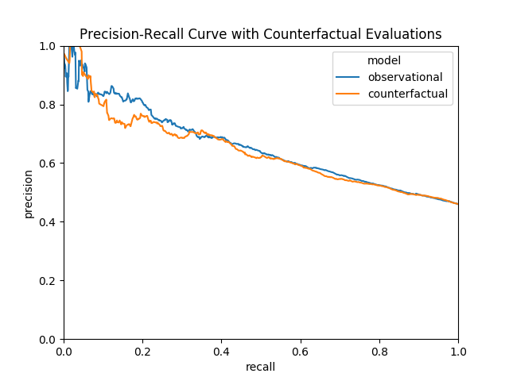
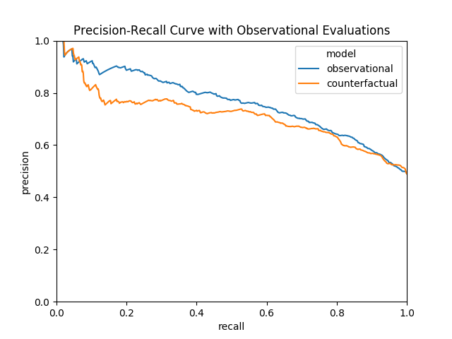
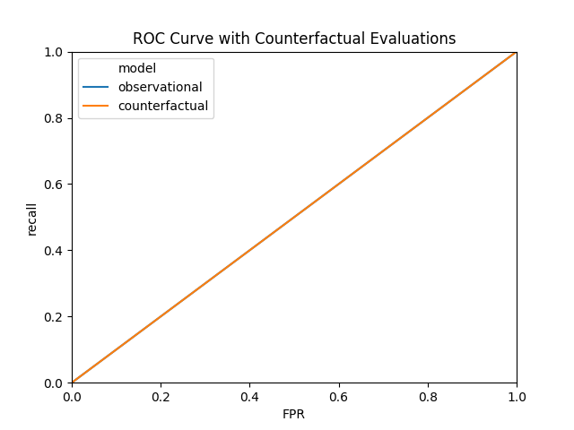
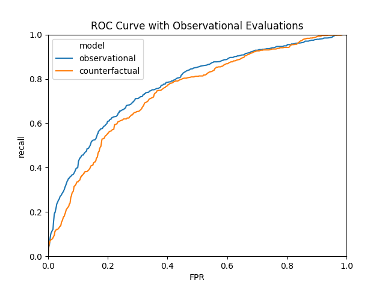

# Counterfactual recidivism risk assessments

This project considers the use of recidivism risk assessments derived from machine learning algorithms as decision-making tools and their fairness. In particular, we study the data collected by ProPublica to examine the COMPAS algorithm and apply doubly-robust counterfactual methods developed by [Coston et al.](https://arxiv.org/abs/1909.00066) to evaluate recidivism risk assessments and their fairness. 

# Background

Risk assessment instruments are increasingly being used to help guide and improve decision making in the criminal justice system. These instruments build risk scores, often via machine learning, for the likelihood of some adverse outcome occuring given available data on an individual. For example, risk assessment instruments have been used to predict recidivism among people accused of a crime, which then is used to inform bail and parole decisions. The overarching goal in this scenario is to predict whether someone accused of a crime, if released for instance, will commit another crime within a fixed period of time. These predictions are then used by judges to make decisions (e.g. detain person before their trial), usually with the goal of mitigating their risk of recidivism. 

There are a number of issues that arise from the use of these risk assessment instruments. The United States already has a mass-incarceration crisis, but to make matters worse, minority populations are the ones disproportionately affected by it. It is possible that risk assessment instruments only exacerbate the disparities that already exist in the criminal justice system. In addition, we do not have data on who commits crimes, we only have data on who is accused of a crime and arrested. There is evidence to suggest that arrest data is skewed towards minority populations by being policed at a higher rate, meaning any machine learning algorithms trained on such data will replicate any such bias present in the data. 

To address these issues, we apply the methods developed by [Coston et al.](https://arxiv.org/abs/1909.00066) to our setting of evaluating recidivism risk assessments and understanding the probabilities of recidivism under proposed decisions. As the authors state, these issues suggest a counterfactual approach as opposed to one of pure prediction. Risk assessment instruments trained to predict recidivism using the historical arrest data answer the question: What is the likelihood of recidivism under the observed historical decisions? Yet, the question of relevance for decision-makers is: What is the likelihood of recidivism under the proposed decision? When the decisions do not impact outcomes, these two questions are equivalent. However, the decision to release persons accused of a crime pretrial clearly affects the likelihood of recidivism, meaning the two will likely differ. Risk assessment instruments must take into account the effects of the interventions as they might appear to perform well according to standard prediction metrics but perform poorly for cases such as those that have historically been receptive to the intervention. 

# Data

We utilize the [data](https://github.com/propublica/compas-analysis) ProPublica obtained from the Broward County Sheriff's Office in Florida to examine the COMPAS (Correctional Offender Management Profiling For Alternative Sanctions) recidivism tool. It includes every defendant that received a COMPAS scores in Broward County from 2013 to 2014. The dataset included variables such as severity of charge, number of priors, demographics, age, sex, the COMPAS scores, and whether each person was accused of a crime within two years. The COMPAS scores for each person range from 1 to 10, with ten being the highest risk. Scores 1 to 4 were considered low risk, 5 to 7 were medium risk, and 8 to 10 were high risk. 

More detail on the data is available on ProPublica's [post](https://www.propublica.org/article/how-we-analyzed-the-compas-recidivism-algorithm).

# Methods

## Counterfactual definitions

Let $Y \in \{0, 1\}$ denote the observed outcome, where $Y=1$ indicates a new arrest within two years and $Y=0$ indicates no new arrest. Let $A \in \{0, 1\}$ denote the binary decision (or treatment/intervention in a classic causal inference sense) made based on COMPAS risk assessment algorithm. Note that in practice, the decision may not be purely binary (different levels of parole/bail decisions). In addition, we make the simplifying assumption that all 1 to 5 COMPAS scores were assigned $A=0$ and all 6 to 10 COMPAS scores were assigned $A=1$. Thus, we then have that $Y^A$ denote the counterfactual outcomes, or the outcomes under decision $A \in \{0, 1\}$, of which we only observe one. We consider $A=0$ to be the baseline decision of no intervention, the one under which it is relevant to assess the risk of the outcome. It is of interest to assess the risk of recidivism if subjects are released pretrial, for instance. Finally, let $\mathbf{X}$ denote the matrix of features used to calculate recidivism risk. 

## Learning models

The observational learning model produces recidivism risk assessments under the observed historical decisions. Statistically, this is equivalent to estimating $\mathrm{E}(Y|X)$ and can be done by training any appropriate classifier to the observed population. 

The counterfactual learning model produces recidivism risk assessments under the baseline decision. Statistically, this is equivalent to estimating $\mathrm{E}(Y^0|X)$. Although we do not observe $Y^0$ for all subjects, this model can still be used to obtain risk estimates for all subjects under the following identification assumptions: Consistency, no unmeasured confounding, and weak positivity. Under these assumptions, our estimand can be written as $\mathrm{E}(Y^0|X) = \mathrm{E}(Y|X,A=0)$, meaning we can train any appropriate classifier to the population that received $A=0$. 

## Evaluation

Ultimately, we want the recidivism risk assessment models to be most informative towards decision-making where it makes sense to target interventions for those most likely to commit another crime. To evaluate whether the ability of the observational and counterfactual learning models to do, we calculate Precision-Recall (PR) and Receiver Operative Characteristic (ROC) curves. The PR curve plots precision against recall and the ROC curve plots recall against the false positive rate (FPR). 

Let $\hat{Y} \in \{0, 1\}$ be the predicted recidivism status from either the observational or counterfactual learning model. Then the observational PR curve plots observational precision, $\mathrm{E}(Y|\hat{Y}=1)$, against observational recall, $\mathrm{E}(\hat{Y}|Y=1)$. The observational ROC curve plots observational recall against observational FPR, $\mathrm{E}(\hat{Y}|Y=0)$.

The counterfactual PR curve plots counterfactual precision, $\mathrm{E}(Y^0|\hat{Y}=1)$, against observational recall, $\mathrm{E}(\hat{Y}|Y^0=1)$. The counterfactual ROC curve plots counterfactual recall against counterfactual FPR, $\mathrm{E}(\hat{Y}|Y^0=0)$. The counterfactual metrics can all be identified by the observed data under the given causal assumptions described above. Estimation of the counterfactual metrics is done via doubly-robust estimation, which have a number of advantages over outcome regression or inverse probability weighting estimates. In particular, the counterfactual metrics require estimating the regression models $\mathrm{E}(Y^0|X)$ and $\text{P}(A=1|X)$, the propensity score. In practice, it is likely that the true functional forms of these models in unknown, so we would therefore like to model them as flexibly as possibly using non-parametric machine learning algorithms. Doubly-robust estimators have faster rates of convergence when using non-parametric methods and are robust to misspecification of one of the regression models. 

## Prediction models

We utilized gradient boosted trees to fit the regression models $\mathrm{E}(Y|X)$, $\mathrm{E}(Y^0|X)$, and $\text{P}(A=1|X)$.

# Feature engineering

We build a SQL-based feature engineering step to extract features for the prediction algorithms. Performing feature engineering on top of existing SQL databases allows for a scalable and easily maintained machine learning pipeline. In addition, there are speed gains over loading all the data into pandas. Lastly, although the ProPublica data is not very large, being SQL based means a similar feature engineering pipeline can be done on clusters for big data.  

# Results

For the precision-recall curve, the observational evaluation suggests that the observational model has better discrimination. The counterfactual evaluation suggests that there is little difference in discrimination. 

For the ROC curve, the observational evaluation again suggests that the observational model has better discrimination; however, the counterfactual evaluation suggests there is little difference in discrimination, albeit both poorly. 

These results suggest that the counterfactual and observational models are performing similarly (predict likelihood of recidivism under proposed intervention decisions) on subjects that received the intervention and did not. However, it is important to keep in mind that the intervention for this project was chosen somewhat arbitrarily. I assumed that all subjects with risk scores above 5 would receive intervention and that those 5 or below would not. 